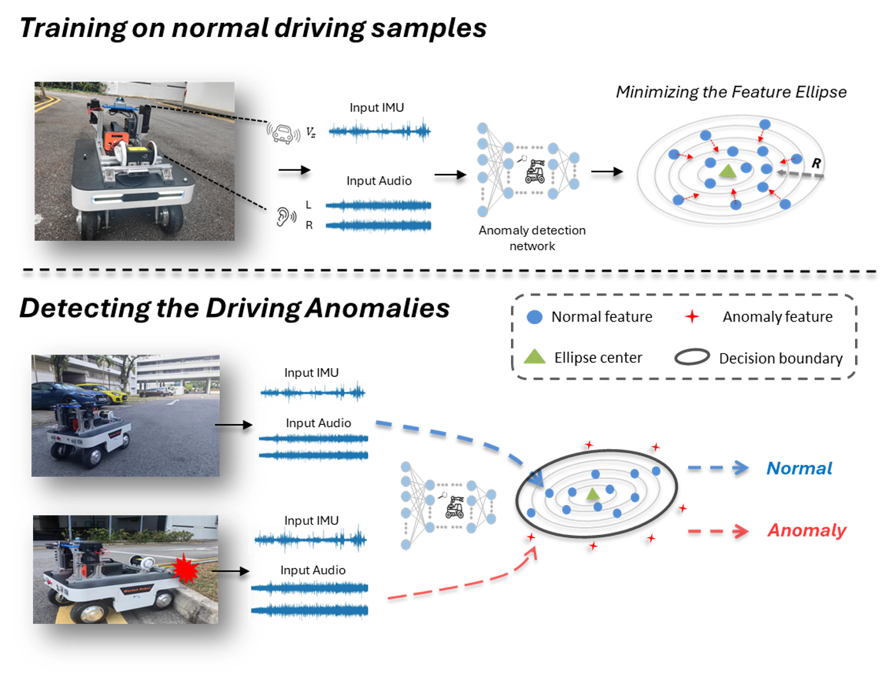

# Audio-Inertia Fusion for Anomaly Detection in Autonomous Mobile Robots Based on Gaussian SVDD  

This repository contains the implementation of our proposed unsupervised anomaly detection network that fuses **audio** and **IMU data** to detect anomalies, including **collisions** and **component failures**.  

Our approach leverages a **Gaussian-based Deep Support Vector Data Description (GSVDD)** model trained solely on **normal operational data**, enabling cost-effective and robust anomaly detection **without the need for annotated fault datasets**.  

---

## Teaser Image  
  

---

## Getting Started  

### Step 1: Set the Configuration  
Edit the configuration file located at:  
`config/config.json`  

### Step 2: Train the Network  
Run the following command to train the model:  
```bash
python GSVDD_train.py
```  

### Step 3: Evaluate the Network  
After training, evaluate the model's performance using:  
`GSVDD_test.ipynb`  

---

## Note
The evaluation of the model on public datasets are presented in timeseries branch.


## References  
- **TranAD**: [TranAD Repository](https://github.com/imperial-qore/TranAD)  
- **DeepOD**: [DeepOD Repository](https://github.com/xuhongzuo/DeepOD)  
---